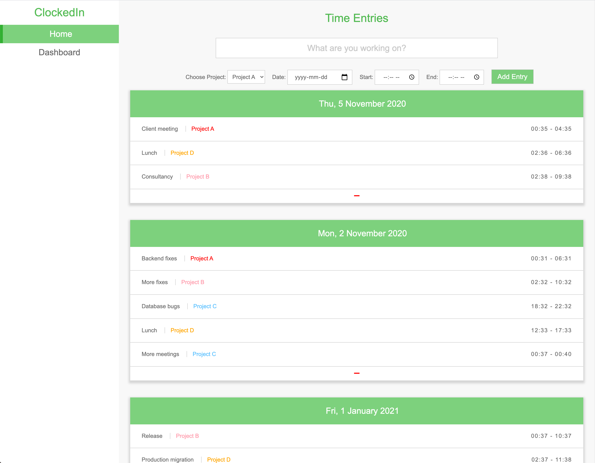

# ClockedIn

_Keep track of how long you spend on tasks for different projects for specific dates._

## Time Tracking

- Pick a project, date and start timer
- Stop timer to add the new entry
- Remove an entry using the - button at the bottom

## Reporting

- Use the dashboard to visualize different reporting breakdowns
- Visualize the time breakdowns for each project on each day and also the total hours spent

      Note: The charts display hours. If your entries are only a few minutes they may look empty.

## Setup & Running

- Clone or download repo
- Open `index.html` file in your browser and start interacting with the app
